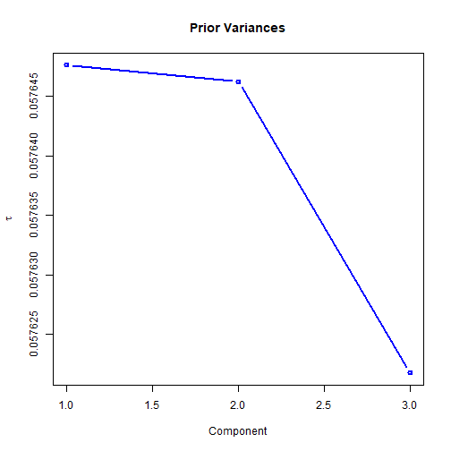
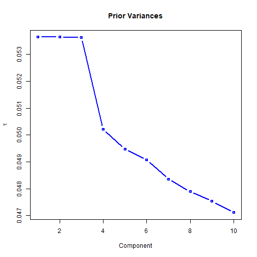
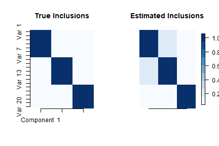
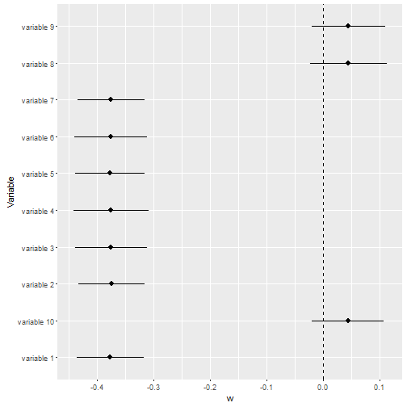

# bayespca: A package for Variational Bayes PCA 

## Theoretical background
Principal Components Analysis (PCA) allows performing dimensionality reduction via matrix factorization.
While there are several ways to express a PCA model, in 
what follows will we consider the formulation 
$$ X = X W P^T + E, $$
where X is a $I \times J$ data matrix ($I$ is the number of units; $J$ the number of 
continuous variables); $W$ is a $J \times D$ weight matrix ($D \leq J$ is the rank of the reduced matrix);
$P$ is the orthogonal loading matrix, such that $P^T P = I_{D \times D}$; and $E$ is an $I \times J$ error matrix. The $D$ principal components can be retrieved with $Z = X W$. 
In this context, the focus of the inference is typically on $W$. In particular, when $J$ is large and the main inferential goal is components' interpretation, it is important for the analyst to obtain
simple and interpretable components. 

The `bayespca` package allows performing the following operations: 

1. estimation of the PCA model, with a Variational Bayes algorithm;   
1. regularization of the elements of $W$ by means of its prior variances; 
1. variable selection, via a Stochastic Search Variable Selection method (a form of "spike-and-slab" prior).


The Variational Bayes algorithm sees the columns of $W$ as latent variables, and $P$ as a fixed parameter. Furthermore, the residuals $E$ are assumed to be distributed according to a Normal distribution with mean 0 and variance $\sigma^2$. The following prior is assumed for the $d$-th column of $W$: 

$$ w_d \sim MVN(0, T_d)  $$

where $MVN()$ denotes the density of the Multivariate Normal Matrix, and T_d denotes the prior (diagonal) covariance matrix of the $d$-th component. The $j$-th element of the diagonal of $T_d$ will be denoted $\tau_{dj}$.  
where $MVN()$ denotes the density of the Multivariate Normal Matrix, and T_d denotes the prior (diagonal) covariance matrix of the $d$-th component. The $j$-th element of the diagonal of $T_d$ will be denoted $\tau_j$.  

## The `bayespca` package 
Variational Bayes PCA is implemented through the ```vbpca``` function, which takes the following arguments as inputs: 

* ```X``` the input matrix; 
* ```D``` the number of components to be estimated; 
* ```maxIter``` the maximum number of iterations for the Variational Bayes algorithm; 
* ```tolerance``` convergence criterion of the algorithm (relative difference between ELBO values); 
* ```verbose``` logical parameter which prints estimation information on screen when ```TRUE```; 
* ```tau``` value of the prior variances; starting value when ```updatetau=TRUE``` or ```priorvar!='fixed' ``` 
* ```updatetau``` logical parameter denoting whether the prior variances should be updated when ```priorvar='fixed'```; 
* ```priorvar``` character argument denoting whether the prior variances should be ```'fixed'```, or random with ```'jeffrey'``` or ```'invgamma'``` priors;  
* ```SVS``` logical argument which activates Stochastic Variable Selection when set to ```TRUE```; 
* ```priorInclusion``` prior inclusion probabilities for the elements of $W$ in the model; 
* ```global.var``` logical parameter which activates component-specific prior variances when set to ```TRUE```; 
* ```control```  other control parameters, such as Inverse Gamma hyperparameters (see ```?vbpca_control``` for more information). 

```vbpca``` returns a vbpca object, which is a list containing various aspect of the model results. See ```?vbpca``` for further information. Internally, ```vbpca``` calls a C++ function (written with Rcpp) to estimate the model. 

In what follows, the various estimation modalities allowed by ```vbpca``` will be introduced. For presentation purposes, a synthetic data matrix with $I = 100$ rows and $J = 20$ columns genereted from three components will be used: 


```r
set.seed(141)
I <- 100
J <- 20 
V1 <- rnorm(I, 0, 50)
V2 <- rnorm(I, 0, 30)
V3 <- rnorm(I, 0, 10)
X <- matrix(c(rep(V1, 7), rep(V2, 7), rep(V3, 6)), I, J)
X <- X + matrix(rnorm(I * J, 0, 1), I, J)
```


I will now proceed with the estimation of the PCA model. 

## Levels of regularization on the W matrix 
### Fixed ```tau``` 
With fixed tau, it is possible to specify the model as follows: 


```r
# Install and load package 
# devtools::install_github("davidevdt/bayespca")
library(bayespca)


# De-activate data center and scaling;
ctrl <- vbpca_control(center = FALSE, scalecorrection = -1, 
                      plot.lowerbound = FALSE)


# Estimate vbpca with fixed prior variances (equal to 1) 
# for the elements of W 
mod1 <- vbpca(X, D = 3, maxIter = 1e+03, priorvar = 'fixed', 
              control = ctrl, verbose = FALSE )


# Test the class of mod1: 
is.vbpca(mod1)
```

```
## [1] TRUE
```

The estimate posterior means of the  $W$ matrix can be viewed with: 


```r
mod1$muW 
```

```
##        Component 1 Component 2   Component 3
##  [1,] -0.376589700 -0.04416511  0.0003399127
##  [2,] -0.373939778 -0.04582346 -0.0111489595
##  [3,] -0.375148658 -0.04305857 -0.0078831845
##  [4,] -0.374770078 -0.04473100 -0.0031124941
##  [5,] -0.376808027 -0.04285792 -0.0100250681
##  [6,] -0.375114066 -0.04446329 -0.0015012124
##  [7,] -0.375069347 -0.04364081 -0.0007181138
##  [8,]  0.043916074 -0.37610685 -0.0194987844
##  [9,]  0.044338996 -0.37382690 -0.0224165536
## [10,]  0.043216238 -0.37319456 -0.0161965576
## [11,]  0.043432789 -0.37311089 -0.0246530518
## [12,]  0.045420158 -0.37574267 -0.0200072059
## [13,]  0.045158091 -0.37616395 -0.0206149568
## [14,]  0.044605651 -0.37571347 -0.0144837533
## [15,]  0.002905219  0.02229238 -0.4057459837
## [16,]  0.003409761  0.02199152 -0.4068881894
## [17,]  0.003232845  0.02063894 -0.4106993908
## [18,]  0.002919709  0.02319335 -0.4056785190
## [19,]  0.002019259  0.02192116 -0.4088024260
## [20,]  0.001874207  0.02043128 -0.4078308025
```

and the $P$ matrix: 


```r
mod1$P 
```

```
##        Component 1 Component 2   Component 3
##  [1,] -0.376589904 -0.04416517  0.0003399179
##  [2,] -0.373939981 -0.04582353 -0.0111491289
##  [3,] -0.375148862 -0.04305863 -0.0078833043
##  [4,] -0.374770282 -0.04473106 -0.0031125414
##  [5,] -0.376808232 -0.04285797 -0.0100252205
##  [6,] -0.375114270 -0.04446335 -0.0015012352
##  [7,] -0.375069551 -0.04364087 -0.0007181247
##  [8,]  0.043916097 -0.37610735 -0.0194990808
##  [9,]  0.044339020 -0.37382740 -0.0224168943
## [10,]  0.043216262 -0.37319506 -0.0161968038
## [11,]  0.043432813 -0.37311139 -0.0246534264
## [12,]  0.045420183 -0.37574317 -0.0200075099
## [13,]  0.045158115 -0.37616446 -0.0206152700
## [14,]  0.044605675 -0.37571398 -0.0144839734
## [15,]  0.002905220  0.02229241 -0.4057521497
## [16,]  0.003409762  0.02199155 -0.4068943728
## [17,]  0.003232846  0.02063897 -0.4107056321
## [18,]  0.002919710  0.02319338 -0.4056846840
## [19,]  0.002019260  0.02192119 -0.4088086384
## [20,]  0.001874208  0.02043131 -0.4078370001
```


Among other things, the function returns also the model evidence lower bound (ELBO) and the estimation time: 


```r
mod1$elbo 
```

```
## [1] -2834.277
```

```r
mod1$time 
```

```
##    user  system elapsed 
##       0       0       0
```


### Fixed, updatable ```tau``` 
The prior variances $\tau_{dj}$ can also be updated via Type-II Maximum Likelihood (empirical Bayes updates): 


```r
mod2 <- vbpca(X, D = 3, maxIter = 1e+03, priorvar = 'fixed',
              updatetau = TRUE, control = ctrl, verbose = FALSE )

mod2$muW
```

```
##         Component 1  Component 2  Component 3
##  [1,] -3.774720e-01 -0.051470102 -0.001822156
##  [2,] -3.744848e-01 -0.025307896 -0.002337156
##  [3,] -3.747070e-01 -0.039179989 -0.002345241
##  [4,] -3.697882e-01 -0.062258505 -0.002242303
##  [5,] -3.794353e-01 -0.031311390 -0.002225193
##  [6,] -3.811333e-01 -0.058594825 -0.001901847
##  [7,] -3.709497e-01 -0.037084346 -0.001895318
##  [8,]  4.572526e-02 -0.388171353 -0.019796029
##  [9,]  4.119102e-02 -0.376636645 -0.023267758
## [10,]  2.518537e-02 -0.376940208 -0.006967316
## [11,]  5.297341e-02 -0.374414696 -0.022267903
## [12,]  4.534880e-02 -0.374381287 -0.013986121
## [13,]  6.385742e-02 -0.370055099 -0.031673499
## [14,]  3.111306e-02 -0.364729611 -0.002535536
## [15,]  1.288107e-05  0.006270320 -0.406011655
## [16,]  1.305259e-05  0.018689756 -0.407077598
## [17,]  1.211560e-05  0.009078483 -0.411159927
## [18,]  1.039548e-05  0.036022360 -0.398788351
## [19,]  1.331297e-05  0.005889322 -0.410538009
## [20,]  1.326763e-05  0.035028974 -0.412758321
```


The matrix of the inverse prior variances can be called with 


```r
mod2$invTau
```

```
##        Component 1 Component 2  Component 3
##  [1,] 6.711653e+00  185.292814 30792.082987
##  [2,] 6.811715e+00  435.456531 24282.641778
##  [3,] 6.733579e+00  246.605678 24174.268756
##  [4,] 6.906649e+00  137.269136 25240.818705
##  [5,] 6.630610e+00  334.561358 25606.215182
##  [6,] 6.535962e+00  151.540810 29303.191067
##  [7,] 6.916642e+00  278.901798 29505.931819
##  [8,] 2.000395e+02    6.283433   670.346568
##  [9,] 2.297542e+02    6.662857   568.834746
## [10,] 4.206301e+02    6.647409  1984.202810
## [11,] 1.678142e+02    6.740676   596.809053
## [12,] 2.033657e+02    6.710938   964.165004
## [13,] 1.294742e+02    6.828244   390.109550
## [14,] 3.541861e+02    7.207997  5635.426286
## [15,] 3.077602e+05 2373.138269     5.837005
## [16,] 3.081676e+05  748.154670     5.771306
## [17,] 3.180735e+05 1556.626018     5.676298
## [18,] 3.115912e+05  349.915331     5.997557
## [19,] 3.116412e+05 2503.322334     5.710167
## [20,] 3.100489e+05  362.448139     5.591906
```


### Random ```tau```: Jeffrey's prior
By assuming Jeffrey's hyperpriors on $\tau_{d,j}$ we set:  

$$ p(\tau_{d,j}) \propto \frac{1}{\tau_{d,j}}.  $$ 

The following code runs the algorithm with Jeffrey's priors on ```tau```: 


```r
mod3 <- vbpca(X, D = 3, maxIter = 1e+03, 
              priorvar = 'jeffrey', control = ctrl, verbose = FALSE )
			  
			  
mod3$muW
```

```
##         Component 1  Component 2  Component 3
##  [1,] -3.762072e-01 -0.051669847 -0.001718286
##  [2,] -3.753663e-01 -0.024957643 -0.002179155
##  [3,] -3.755221e-01 -0.039050104 -0.002184467
##  [4,] -3.694122e-01 -0.062405832 -0.002095490
##  [5,] -3.804778e-01 -0.031175496 -0.002080751
##  [6,] -3.804682e-01 -0.058826990 -0.001785660
##  [7,] -3.705392e-01 -0.036933654 -0.001783597
##  [8,]  4.681938e-02 -0.388318730 -0.019714801
##  [9,]  4.140105e-02 -0.376744554 -0.023221555
## [10,]  2.630865e-02 -0.376993005 -0.006755614
## [11,]  5.078766e-02 -0.374364439 -0.022225937
## [12,]  4.534032e-02 -0.374417607 -0.013628847
## [13,]  6.314263e-02 -0.370025997 -0.031527208
## [14,]  3.138958e-02 -0.364536417 -0.002429599
## [15,] -5.988475e-06  0.006004422 -0.406018863
## [16,] -5.753386e-06  0.018302788 -0.406955301
## [17,] -6.315337e-06  0.008713880 -0.411158474
## [18,] -7.980688e-06  0.036268370 -0.398755119
## [19,] -5.552139e-06  0.005629840 -0.410622420
## [20,] -5.662205e-06  0.035039733 -0.412865313
```

```r
mod3$invTau 
```

```
##        Component 1 Component 2  Component 3
##  [1,] 6.755108e+00  184.397432 34474.447450
##  [2,] 6.781195e+00  442.648244 27480.918786
##  [3,] 6.705945e+00  247.645663 27392.152386
##  [4,] 6.919912e+00  136.854417 28507.875401
##  [5,] 6.595924e+00  336.309756 28900.632235
##  [6,] 6.557748e+00  150.778136 32956.292021
##  [7,] 6.931301e+00  280.357630 33103.785341
##  [8,] 1.941867e+02    6.278975   675.700374
##  [9,] 2.284549e+02    6.659287   571.930720
## [10,] 4.008565e+02    6.645666  2054.421916
## [11,] 1.770003e+02    6.742445   599.980458
## [12,] 2.033806e+02    6.709787   993.678825
## [13,] 1.313076e+02    6.829335   393.545372
## [14,] 3.504575e+02    7.215396  5895.969600
## [15,] 3.431666e+05 2488.239113     5.836825
## [16,] 3.436743e+05  768.309909     5.774690
## [17,] 3.546114e+05 1628.566791     5.676387
## [18,] 3.471180e+05  348.427445     5.998570
## [19,] 3.475540e+05 2628.776461     5.707931
## [20,] 3.459061e+05  363.790032     5.589196
```


### Random ```tau```: Inverse Gamma prior 
It is possible to specify an inverse gamma prior on $\tau_{d,j}$: 

$$ \tau_{d,j} \sim IG(\alpha, \beta) $$

with $\alpha$ shape parameter and $\beta$ scale parameter. The following code implements an IG(2, .5) prior on the variances: 


```r
# Set hyperparameter values 
ctrl2 <- vbpca_control(center = FALSE, scalecorrection = -1,
                       plot.lowerbound = FALSE, 
					   alphatau = 2, betatau = .5)
					   
					   
					   
# Estimate the model 
mod4 <- vbpca(X, D = 3, maxIter = 1e+03, priorvar = 'invgamma', 
              control = ctrl2, verbose = FALSE )
			  
			  
mod4$muW 
```

```
##        Component 1 Component 2   Component 3
##  [1,] -0.376590725 -0.04416826  0.0002947089
##  [2,] -0.373916478 -0.04580818 -0.0111139002
##  [3,] -0.375152260 -0.04306330 -0.0078485203
##  [4,] -0.374771451 -0.04473662 -0.0031287802
##  [5,] -0.376819149 -0.04285298 -0.0099904658
##  [6,] -0.375128188 -0.04445803 -0.0015201459
##  [7,] -0.375056611 -0.04365135 -0.0007401483
##  [8,]  0.043918292 -0.37612390 -0.0195191684
##  [9,]  0.044336996 -0.37380699 -0.0224249101
## [10,]  0.043215418 -0.37316141 -0.0162245050
## [11,]  0.043435548 -0.37309952 -0.0245960805
## [12,]  0.045416539 -0.37575273 -0.0200103648
## [13,]  0.045161055 -0.37621087 -0.0206044028
## [14,]  0.044603008 -0.37569186 -0.0144838955
## [15,]  0.002901159  0.02228837 -0.4056891063
## [16,]  0.003405260  0.02198287 -0.4068836504
## [17,]  0.003228832  0.02064976 -0.4107113982
## [18,]  0.002920806  0.02319222 -0.4056322666
## [19,]  0.002018556  0.02191743 -0.4087810436
## [20,]  0.001885825  0.02043591 -0.4078295957
```

```r
mod4$invTau
```

```
##       Component 1 Component 2 Component 3
##  [1,]    4.349798    4.952591    4.962213
##  [2,]    4.357381    4.951847    4.961554
##  [3,]    4.349198    4.947077    4.955868
##  [4,]    4.347326    4.942587    4.952373
##  [5,]    4.346511    4.949795    4.958338
##  [6,]    4.348754    4.945842    4.955514
##  [7,]    4.353855    4.952447    4.961810
##  [8,]    4.940550    4.341632    4.948114
##  [9,]    4.944064    4.351079    4.951230
## [10,]    4.946698    4.354576    4.954566
## [11,]    4.941841    4.351048    4.948103
## [12,]    4.940429    4.343068    4.948542
## [13,]    4.934790    4.337277    4.942629
## [14,]    4.954153    4.353743    4.962926
## [15,]    4.964065    4.961664    4.266733
## [16,]    4.955381    4.953028    4.256713
## [17,]    4.956688    4.954630    4.246359
## [18,]    4.954427    4.951810    4.259675
## [19,]    4.962441    4.960082    4.256343
## [20,]    4.950618    4.948561    4.250325
```


```alphatau``` and ```betatau``` can also be specified as $D$-dimensional array, in which case the Inverse Gamma will have component-specific hyperparameters: 
$$ \tau_{d,j} \sim IG(\alpha_d, \beta_d) $$. 


```r
# Set hyperparameter values 
ctrl3 <- vbpca_control(center = FALSE, scalecorrection = -1,
                       plot.lowerbound = FALSE, 
					   alphatau = c(.5, 50, 3), betatau = c(.5, .01, 10), 
					   hypertype = 'component')
					   
					   
# Estimate the model 
mod5 <- vbpca(X, D = 3, maxIter = 1e+03, priorvar = 'invgamma', 
              control = ctrl3, verbose = FALSE )

			  
mod5$muW 
```

```
##        Component 1  Component 2   Component 3
##  [1,] -0.378535069 -0.022550177  0.0025320655
##  [2,] -0.376010408 -0.021331002 -0.0088680201
##  [3,] -0.377058121 -0.022705524 -0.0057334841
##  [4,] -0.376765736 -0.022799099 -0.0008880582
##  [5,] -0.378711737 -0.022502952 -0.0078832752
##  [6,] -0.377093814 -0.019646614  0.0006966940
##  [7,] -0.376981673 -0.026435232  0.0014645273
##  [8,]  0.021618521 -0.045787586 -0.0012802351
##  [9,]  0.022165897 -0.050285073 -0.0042910494
## [10,]  0.021098823 -0.037934476  0.0018542188
## [11,]  0.021297952 -0.049321093 -0.0065615922
## [12,]  0.023138118 -0.049443570 -0.0017949202
## [13,]  0.022842413 -2.348222240 -0.0025229191
## [14,]  0.022345189 -0.049142867  0.0037198670
## [15,]  0.002992116  0.002091087 -0.4063507109
## [16,]  0.003475947 -0.001948958 -0.4074613372
## [17,]  0.003205251  0.009070114 -0.4112473691
## [18,]  0.003062334  0.006593144 -0.4063446402
## [19,]  0.002077795  0.003818705 -0.4093929706
## [20,]  0.001857368 -0.003947850 -0.4083201743
```

```r
mod5$invTau 
```

```
##       Component 1 Component 2 Component 3
##  [1,]    1.735068  4883.95439   0.3498320
##  [2,]    1.737956  4896.56336   0.3498312
##  [3,]    1.734465  4881.98803   0.3498046
##  [4,]    1.733223  4881.05886   0.3497852
##  [5,]    1.733528  4884.42780   0.3498147
##  [6,]    1.734107  4913.05908   0.3498008
##  [7,]    1.736710  4838.95652   0.3498308
##  [8,]    1.974312  4527.17251   0.3497740
##  [9,]    1.976205  4440.53154   0.3497924
## [10,]    1.977395  4665.76589   0.3498030
## [11,]    1.974916  4459.48648   0.3497789
## [12,]    1.974487  4457.06148   0.3497771
## [13,]    1.971541    18.24647   0.3497487
## [14,]    1.981271  4463.32575   0.3498394
## [15,]    1.982402  5007.31481   0.3469784
## [16,]    1.977961  5007.38609   0.3469217
## [17,]    1.978586  4988.06776   0.3468739
## [18,]    1.977499  4997.44534   0.3469332
## [19,]    1.981517  5004.88288   0.3469270
## [20,]    1.975535  5004.38616   0.3468870
```
Notice the different level of regularization obtained across the different components. In order to activate these 'component-specific' hyperpriors, ```hypertype = 'component'``` was specified.  


### Random ```tau```, random ```betatau```
It is also possible to specify a Gamma hyperprior on $\beta$ (while $\alpha$ remains fixed): 
$$ \beta \sim Ga(\gamma, \delta). $$
This is achievable by setting ```gammatau``` (and ```deltatau```) larger than 0 in the control parameters: 


```r
# Specify component-specific Gamma(.01, 10) hyperpriors on betatau 
ctrl4 <- vbpca_control(center = FALSE, scalecorrection = -1, 
                       plot.lowerbound = FALSE, 
					   alphatau = 1, betatau = 1,
					   gammatau = .01, deltatau = 10, 
					   hypertype = 'component')

					   
# Estimate the model 
mod6 <- vbpca(X, D = 3, maxIter = 1e+03, priorvar = 'invgamma', 
              control = ctrl4, verbose = FALSE )
			  
			  
mod6$muW 
```

```
##        Component 1 Component 2  Component 3
##  [1,] -0.376612836 -0.04414791 -0.001248665
##  [2,] -0.373527098 -0.04527330 -0.009492228
##  [3,] -0.375300115 -0.04330108 -0.006689935
##  [4,] -0.374545218 -0.04475906 -0.003778637
##  [5,] -0.377133411 -0.04290093 -0.008534217
##  [6,] -0.375467993 -0.04449136 -0.002517447
##  [7,] -0.374843813 -0.04378361 -0.001752866
##  [8,]  0.044090921 -0.37645722 -0.020075378
##  [9,]  0.044279637 -0.37340637 -0.022183245
## [10,]  0.043230956 -0.37276205 -0.017350634
## [11,]  0.043633248 -0.37285565 -0.022662370
## [12,]  0.045225801 -0.37597165 -0.020153747
## [13,]  0.045216689 -0.37689952 -0.020320873
## [14,]  0.044313381 -0.37547626 -0.014958361
## [15,]  0.002830475  0.02204270 -0.405124312
## [16,]  0.003209544  0.02187185 -0.407342357
## [17,]  0.003155435  0.02095304 -0.410906971
## [18,]  0.002824749  0.02288630 -0.405233175
## [19,]  0.002136077  0.02174539 -0.408749536
## [20,]  0.002176061  0.02077001 -0.407947441
```

```r
mod6$invTau 
```

```
##       Component 1 Component 2 Component 3
##  [1,]    14.91448    50.12038    65.06736
##  [2,]    15.08009    50.01542    64.75625
##  [3,]    14.89640    49.61854    64.01402
##  [4,]    14.91646    49.35990    64.02027
##  [5,]    14.84777    50.00467    64.60364
##  [6,]    14.89316    49.61383    64.18919
##  [7,]    14.99621    50.11334    64.83842
##  [8,]    49.11895    14.79168    63.03510
##  [9,]    49.33578    14.99044    63.23453
## [10,]    49.58424    15.04221    63.72938
## [11,]    49.21586    15.00398    62.95653
## [12,]    49.08557    14.80959    63.03858
## [13,]    48.70446    14.70323    62.43163
## [14,]    50.23753    15.02297    64.98818
## [15,]    51.91718    51.58330    14.15424
## [16,]    51.29932    50.86616    13.95682
## [17,]    51.45181    51.11369    13.78557
## [18,]    51.19581    50.75885    14.05424
## [19,]    51.89061    51.52052    13.95095
## [20,]    50.91504    50.55465    13.87395
```


The posterior means of $\beta$ can be accessed via 


```r
mod6$priorBeta 
```

```
##            [,1]       [,2]       [,3]
## [1,] 0.02635365 0.02630866 0.02068517
## attr(,"names")
## [1] "beta 1" "beta 2" "beta 3"
```


```hypertype``` specify the type of hyperprior for ```beta```: 

* ```'common'``` implies $\beta \sim Ga(\alpha, \beta)$;
* ```'component'``` implies $\beta_d \sim Ga(\alpha_d, \beta_d)$;
* ```'local'``` implies $\beta_{dj} \sim Ga(\alpha_{dj}, \beta_{dj})$.


Similar to ```alphatau``` and ```betatau```, ```gammatau``` and ```deltatau``` can also be $D$-dimensional arrays for component-specific hyperpriors on $\beta$. 

### Global prior variances 
So far, the parameter ```global.var``` has always ben set to ```FALSE```, implying 
$$ w_{j,d} \sim N(0, \tau_{j,d}). $$
Setting ```global.var = TRUE``` will modify this formulation, which will switch to 
$$ w_{j,d} \sim N(0, \tau_{d}) $$
that is, component-specific variances (called 'global variances' in ```vbpca```) will be estimated instead: 


```r
# Fixed prior global variances, updated via Type-II maximum likelihood: 
mod7 <- vbpca(X, D = 3, maxIter = 1e+03, priorvar = 'fixed',
              updatetau = TRUE, control = ctrl, verbose = FALSE, 
			  global.var = TRUE)
```



```r
mod7$muW 
```

```
##        Component 1 Component 2   Component 3
##  [1,] -0.376586376 -0.04416415  0.0003398288
##  [2,] -0.373936478 -0.04582247 -0.0111462062
##  [3,] -0.375145347 -0.04305764 -0.0078812377
##  [4,] -0.374766771 -0.04473003 -0.0031117254
##  [5,] -0.376804702 -0.04285698 -0.0100225924
##  [6,] -0.375110756 -0.04446232 -0.0015008417
##  [7,] -0.375066036 -0.04363986 -0.0007179364
##  [8,]  0.043915686 -0.37609866 -0.0194939691
##  [9,]  0.044338605 -0.37381876 -0.0224110177
## [10,]  0.043215857 -0.37318643 -0.0161925578
## [11,]  0.043432406 -0.37310277 -0.0246469635
## [12,]  0.045419757 -0.37573449 -0.0200022650
## [13,]  0.045157692 -0.37615576 -0.0206098658
## [14,]  0.044605257 -0.37570529 -0.0144801764
## [15,]  0.002905193  0.02229190 -0.4056457820
## [16,]  0.003409731  0.02199105 -0.4067877056
## [17,]  0.003232816  0.02063849 -0.4105979658
## [18,]  0.002919683  0.02319284 -0.4055783339
## [19,]  0.002019241  0.02192068 -0.4087014694
## [20,]  0.001874190  0.02043084 -0.4077300859
```

```r
mod7$invTau 
```

```
## [1] 17.34676 17.34719 17.35455
```


Notice the plot of the prior variances (inverse precisions) that appears in this case. This is useful when 
the number of components supported by the data is uncertain (elbow method): 


```r
mod8 <- vbpca(X, D = 10, maxIter = 1e+03, priorvar = 'fixed',
              updatetau = TRUE, global.var = TRUE, 
			  control = ctrl, verbose = FALSE )
```




## Stochastic Search Variable Selection 
By requiring ```SVS = TRUE```, the model activates stochastic-search-variable-selection, a method described by George ad McCulloch (1993) for the Gibbs Sampler. The method has been adapted in *bayespca* for the Variational Bayes algorithm. The assumed 'spike-and-slab' prior for the $(j,d)$-th element of $W$ becomes: 

$$ w_{j,d} \sim N(0, \pi \tau + (1 - \pi) \tau v_0)  $$

where $v_0$ is a scalar which rescales the spike variance to a value close to 0. For this reason, $v_0$ should be a number included in $(0, 1)$, as close as possible to 0. $\pi$ represents the prior probability of inclusion of the $j$-th variable in the $d$-th component of the model. ```vbpca``` estimates the posterior probabilities of inclusion, conditional on $X$ and the values in $W$. 

While $v_0$ should be a small value close to 0, too small values of such parameter will shrink the variances $\tau$ too much, and no variable will eventually be included in the model. On the other hand, using a too large value for $v_0$ will not shrink the variances enough, and all posterior inclusion probabilities will be close to 1. $v_0$ should then be set with a grain of salt. Preliminary results from partial simulation studies have shown that values between 0.0001 and 0.005 lead to acceptable results, but adequate values of $v_0$ can be dataset-specific. Preliminary simulation studies have also shown that the method works better when Inverse Gamma priors are specified for $\tau$, with ```betatau``` equal to 1 and larger values of ```alphatau```. However, the technique has just been devised and further studies must be carried out to further test the functioning of Stochastic Variable Selection in this context. 

In ```vbpca```, the parameter $v_0$ is called ```v0``` in the control parameters of ```vbpca_control```, while the prior inclusion probability is called ```priorInclusion```. ```priorInclusion``` can be fixed, updated via Type-II maximum likelihood, or assigned to a Beta hyperprior: 

* among the control parameters of ```vbpca_control```, set ```beta1pi``` smaller than 0 for fixed $\pi$; 
* set ```beta1pi = 0``` instead for Type-II ML updates; 
* last, set ```beta1pi``` larger than 0 for Beta specifications. 

When ```beta1pi``` is larger than 0, a Beta prior is assumed for $\pi$: 

$$ \pi \sim Beta(\beta_1, \beta_2).$$

In ```vbpca```, $\beta1$ can be controlled with the ```beta1pi``` argument and $\beta2$ with the ```beta2pi``` argument in ```vbpca_control```.


```r
# SVS, fixed priorInclusion and InverseGamma(5, 1) for tau, v0 = .005
ctrl5 <- vbpca_control(center = FALSE, scalecorrection = -1, 
					   plot.lowerbound = FALSE, 
					   alphatau = 5, betatau = 1,
					   beta1pi = -1, v0 = 5e-03)

# Estimate the model with priorInclusion = 0.5
mod9 <- vbpca(X, D = 3, maxIter = 1e+03, priorvar = 'invgamma',
              SVS = TRUE, priorInclusion = 0.5, control = ctrl5,
			  verbose = FALSE )					   

mod9$muW 
```

```
##        Component 1 Component 2  Component 3
##  [1,] -0.376748781 -0.04448419 -0.004118464
##  [2,] -0.372475633 -0.04361763 -0.005760081
##  [3,] -0.375667438 -0.04356739 -0.004991567
##  [4,] -0.373841437 -0.04448232 -0.004702291
##  [5,] -0.377538204 -0.04319580 -0.005460548
##  [6,] -0.375841926 -0.04472555 -0.004526083
##  [7,] -0.375415421 -0.04399647 -0.004250611
##  [8,]  0.044408685 -0.37703894 -0.019875476
##  [9,]  0.043998937 -0.37297946 -0.020143278
## [10,]  0.043266722 -0.37566487 -0.019143767
## [11,]  0.043857102 -0.37129411 -0.019783811
## [12,]  0.044746209 -0.37519130 -0.019756230
## [13,]  0.045169995 -0.37456826 -0.019725427
## [14,]  0.043746355 -0.37732922 -0.018255778
## [15,]  0.002623419  0.02125881 -0.405658519
## [16,]  0.002688735  0.02140113 -0.407985305
## [17,]  0.002848870  0.02135504 -0.409081847
## [18,]  0.002537808  0.02133019 -0.406355278
## [19,]  0.002543663  0.02127051 -0.408688560
## [20,]  0.002678639  0.02114513 -0.408149455
```

```r
# SVS, priorInclusion update via Type-II ML and InverseGamma(5, 1) for tau, v0 = .005
ctrl6 <- vbpca_control(center = FALSE, scalecorrection = -1, 
                       plot.lowerbound = FALSE, 
					   alphatau = 5, betatau = 1,
					   beta1pi = 0, v0 = 5e-03)


# Estimate the model 
mod10 <- vbpca(X, D = 3, maxIter = 1e+03, priorvar = 'invgamma',
               SVS = TRUE, control = ctrl6, verbose = FALSE )

mod10$muW
```

```
##        Component 1 Component 2  Component 3
##  [1,] -0.376820403 -0.04443274 -0.004105331
##  [2,] -0.372342825 -0.04359154 -0.005703954
##  [3,] -0.375714669 -0.04343893 -0.004950388
##  [4,] -0.373896216 -0.04418282 -0.004672491
##  [5,] -0.377494063 -0.04330092 -0.005410152
##  [6,] -0.375803977 -0.04448199 -0.004502587
##  [7,] -0.375540004 -0.04397016 -0.004233775
##  [8,]  0.044272156 -0.37707966 -0.019695158
##  [9,]  0.043953350 -0.37295603 -0.019949514
## [10,]  0.043389387 -0.37573980 -0.018994759
## [11,]  0.043792275 -0.37127266 -0.019600074
## [12,]  0.044486863 -0.37516935 -0.019579317
## [13,]  0.044628213 -0.37453668 -0.019545357
## [14,]  0.043972815 -0.37745452 -0.018153343
## [15,]  0.002609130  0.02108194 -0.405657865
## [16,]  0.002665408  0.02120868 -0.407997718
## [17,]  0.002843743  0.02116518 -0.409083064
## [18,]  0.002534612  0.02112394 -0.406366335
## [19,]  0.002532725  0.02108904 -0.408695150
## [20,]  0.002668113  0.02094568 -0.408176915
```

```r
# SVS, priorInclusion with Beta(1,1) priors and InverseGamma(5, 1) for tau, v0 = .005
ctrl7 <- vbpca_control(center = FALSE, scalecorrection = -1,
                       plot.lowerbound = FALSE, alphatau = 5,
					   betatau = 1, beta1pi = 1, beta2pi = 1, 
					   v0 = 1e-03)

					   
# Estimate the model
mod11 <- vbpca(X, D = 3, maxIter = 1e+03, priorvar = 'invgamma', 
              SVS = TRUE, priorInclusion = 0.5, control = ctrl7,
			  verbose = FALSE )	

			  
mod11$muW 			  
```

```
##        Component 1  Component 2  Component 3
##  [1,] -0.377578349 -0.047910030 -0.002002242
##  [2,] -0.373170166 -0.042515344 -0.002378816
##  [3,] -0.374430126 -0.040415504 -0.002185917
##  [4,] -0.375072133 -0.046525265 -0.002135318
##  [5,] -0.376008730 -0.039445556 -0.002304975
##  [6,] -0.375859884 -0.047111723 -0.002099864
##  [7,] -0.375405101 -0.045679887 -0.002032556
##  [8,]  0.043405151 -0.378473952 -0.006164428
##  [9,]  0.044375902 -0.373876173 -0.006209141
## [10,]  0.042245921 -0.377090189 -0.006001771
## [11,]  0.044751842 -0.368672388 -0.006116497
## [12,]  0.044958898 -0.376869033 -0.006128563
## [13,]  0.045638798 -0.375085381 -0.006120630
## [14,]  0.044350991 -0.377236487 -0.005819845
## [15,]  0.001437227  0.006323692 -0.405995608
## [16,]  0.001446743  0.006322625 -0.408537375
## [17,]  0.001465363  0.006378243 -0.409385330
## [18,]  0.001440418  0.006341427 -0.406803848
## [19,]  0.001424396  0.006367079 -0.409223708
## [20,]  0.001427028  0.006333777 -0.409086743
```


The estimated posterior inclusion probabilities for the three  models: 


```r
mod9$inclusionProbabilities
```

```
##             [,1]      [,2]       [,3]
##  [1,] 1.00000000 0.2119197 0.09722059
##  [2,] 1.00000000 0.2067622 0.09847080
##  [3,] 1.00000000 0.2083132 0.09893331
##  [4,] 1.00000000 0.2138161 0.09839703
##  [5,] 1.00000000 0.2043346 0.09818925
##  [6,] 1.00000000 0.2145334 0.09844897
##  [7,] 1.00000000 0.2089924 0.09789326
##  [8,] 0.21419852 1.0000000 0.11720313
##  [9,] 0.21103005 1.0000000 0.11749524
## [10,] 0.20602971 1.0000000 0.11538121
## [11,] 0.21062206 1.0000000 0.11704114
## [12,] 0.21585734 1.0000000 0.11699144
## [13,] 0.21973753 1.0000000 0.11755002
## [14,] 0.20652527 1.0000000 0.11220954
## [15,] 0.09656056 0.1178761 1.00000000
## [16,] 0.09698534 0.1193360 1.00000000
## [17,] 0.09664596 0.1184619 1.00000000
## [18,] 0.09701643 0.1191947 1.00000000
## [19,] 0.09630871 0.1177812 1.00000000
## [20,] 0.09738379 0.1190830 1.00000000
```

```r
mod10$inclusionProbabilities
```

```
##             [,1]       [,2]       [,3]
##  [1,] 1.00000000 0.14595571 0.06591143
##  [2,] 1.00000000 0.14236100 0.06674450
##  [3,] 1.00000000 0.14281308 0.06703891
##  [4,] 1.00000000 0.14589407 0.06668594
##  [5,] 1.00000000 0.14122352 0.06655497
##  [6,] 1.00000000 0.14674973 0.06671996
##  [7,] 1.00000000 0.14397192 0.06635530
##  [8,] 0.14688020 1.00000000 0.07946508
##  [9,] 0.14513342 1.00000000 0.07965978
## [10,] 0.14241065 1.00000000 0.07827022
## [11,] 0.14472254 1.00000000 0.07935064
## [12,] 0.14747139 1.00000000 0.07932312
## [13,] 0.14867799 1.00000000 0.07967706
## [14,] 0.14348255 1.00000000 0.07619741
## [15,] 0.06545289 0.08000438 1.00000000
## [16,] 0.06572667 0.08094135 1.00000000
## [17,] 0.06550593 0.08036715 1.00000000
## [18,] 0.06574893 0.08082310 1.00000000
## [19,] 0.06528540 0.07993301 1.00000000
## [20,] 0.06598849 0.08074012 1.00000000
```

```r
mod11$inclusionProbabilities
```

```
##             [,1]       [,2]       [,3]
##  [1,] 1.00000000 1.00000000 0.06863487
##  [2,] 1.00000000 1.00000000 0.06904590
##  [3,] 1.00000000 1.00000000 0.06902865
##  [4,] 1.00000000 1.00000000 0.06891943
##  [5,] 1.00000000 1.00000000 0.06891337
##  [6,] 1.00000000 1.00000000 0.06891772
##  [7,] 1.00000000 1.00000000 0.06880151
##  [8,] 1.00000000 1.00000000 0.07472949
##  [9,] 1.00000000 1.00000000 0.07482446
## [10,] 1.00000000 1.00000000 0.07440630
## [11,] 1.00000000 1.00000000 0.07469438
## [12,] 1.00000000 1.00000000 0.07466636
## [13,] 1.00000000 1.00000000 0.07472689
## [14,] 1.00000000 1.00000000 0.07375244
## [15,] 0.06813425 0.07458764 1.00000000
## [16,] 0.06826714 0.07472781 1.00000000
## [17,] 0.06805943 0.07461328 1.00000000
## [18,] 0.06826063 0.07476505 1.00000000
## [19,] 0.06803569 0.07458175 1.00000000
## [20,] 0.06822868 0.07472175 1.00000000
```

It is also possible to compare the (known) variable inclusion matrix vs. the estimated ones graphically. Let's plot a heatmap of such probabilities for model ```mod9```: 


```r
trueInclusions <- matrix(0, J, 3)
trueInclusions[1:7, 1] <- 1
trueInclusions[8:14, 2] <- 1 
trueInclusions[15:20, 3] <- 1

par(mfrow=c(1,2))
image(1:ncol(trueInclusions), 1:nrow(trueInclusions),  
      t(trueInclusions[J:1, ]), ylab = "", axes = FALSE, 
	  main = "True Inclusions", xlab = "",
	  col =  RColorBrewer::brewer.pal(9, "Blues"))
axis(side = 1, at = 1:3, labels = paste("Component ", 1:3 ))	  
axis(side = 2, at = 1:20, labels = paste("Var ", J:1 ))	

fields::image.plot(1:ncol(trueInclusions), 1:nrow(trueInclusions),  
      t(mod9$inclusionProbabilities[J:1, ]), ylab = "", axes = FALSE, 
	  main = "Estimated Inclusions", xlab = "",
	  col = RColorBrewer::brewer.pal(9, "Blues"))  
axis(side = 1, at = 1:3, labels = paste("Component ", 1:3 ))	  	  
```




For ```mod10``` and ```mod11``` we can observe the estimated prior inclusion probabilities: 


```r
mod10$priorInclusion
```

```
##           [,1]
## [1,] 0.3987037
## [2,] 0.3987037
## [3,] 0.3987037
```

```r
mod11$priorInclusion
```

```
##          [,1]
## [1,] 0.594533
## [2,] 0.594533
## [3,] 0.594533
```

Similar to the hyperparameters of the Inverse Gamma priors on $\tau$, ```priorInclusion```, ```beta1pi``` and ```beta2pi```can also be specified as $D$-dimensional arrays. This will allow estimating the inclusion probabilities with different degrees of 'sparsity' for each component. For Type-II maximum likelihood updates of ```priorInclusion```, all elements of ```beta1pi``` must be equal to 0. For Beta priors, all elements of ```beta1pi``` must be larger than 0.  Let us look at two examples: 


```r
# Type-II maximum likelihood (component-specific) updates 
ctrl8 <- vbpca_control(center = FALSE, scalecorrection = -1, 
                       plot.lowerbound = FALSE, 
					   alphatau = 5, betatau = 1,
					   beta1pi = rep(0, 3), v0 = 5e-03)

# Estimate the model 
mod12 <- vbpca(X, D = 3, maxIter = 1e+03, priorvar = 'invgamma', 
               SVS = TRUE, priorInclusion = rep(0.5, 3),
			   control = ctrl8, verbose = FALSE )


mod12$muW
```

```
##        Component 1 Component 2  Component 3
##  [1,] -0.376815314 -0.04442994 -0.004105677
##  [2,] -0.372377110 -0.04356041 -0.005685535
##  [3,] -0.375706910 -0.04340680 -0.004938422
##  [4,] -0.373904118 -0.04418880 -0.004665602
##  [5,] -0.377491770 -0.04324636 -0.005394055
##  [6,] -0.375805352 -0.04449342 -0.004498355
##  [7,] -0.375526972 -0.04394678 -0.004232412
##  [8,]  0.044263800 -0.37707627 -0.019646180
##  [9,]  0.043932375 -0.37297930 -0.019894678
## [10,]  0.043343358 -0.37571010 -0.018958464
## [11,]  0.043768765 -0.37129276 -0.019549524
## [12,]  0.044484539 -0.37519022 -0.019531727
## [13,]  0.044640336 -0.37456687 -0.019496815
## [14,]  0.043933453 -0.37742346 -0.018136623
## [15,]  0.002608240  0.02103643 -0.405655232
## [16,]  0.002665114  0.02116643 -0.408001312
## [17,]  0.002841361  0.02111936 -0.409083269
## [18,]  0.002533538  0.02108528 -0.406367096
## [19,]  0.002530947  0.02104353 -0.408696279
## [20,]  0.002665016  0.02090398 -0.408188568
```

```r
mod12$priorInclusion
```

```
##           [,1]
## [1,] 0.4294228
## [2,] 0.4359323
## [3,] 0.3399249
```

```r
mod12$inclusionProbabilities 
```

```
##             [,1]       [,2]       [,3]
##  [1,] 1.00000000 0.16799387 0.05168586
##  [2,] 1.00000000 0.16374569 0.05233463
##  [3,] 1.00000000 0.16430571 0.05255872
##  [4,] 1.00000000 0.16801270 0.05228552
##  [5,] 1.00000000 0.16234229 0.05218633
##  [6,] 1.00000000 0.16899906 0.05231170
##  [7,] 1.00000000 0.16562408 0.05202976
##  [8,] 0.16501213 1.00000000 0.06235012
##  [9,] 0.16298497 1.00000000 0.06250196
## [10,] 0.15981506 1.00000000 0.06142445
## [11,] 0.16252283 1.00000000 0.06225847
## [12,] 0.16569009 1.00000000 0.06223902
## [13,] 0.16713070 1.00000000 0.06250883
## [14,] 0.16099504 1.00000000 0.05982298
## [15,] 0.07386198 0.09239017 1.00000000
## [16,] 0.07417472 0.09348813 1.00000000
## [17,] 0.07392333 0.09281332 1.00000000
## [18,] 0.07420049 0.09335883 1.00000000
## [19,] 0.07367201 0.09230762 1.00000000
## [20,] 0.07447276 0.09326539 1.00000000
```

```r
# Beta priors with different degrees of sparsity for each component 
ctrl9 <- vbpca_control(center = FALSE, scalecorrection = -1,
                       plot.lowerbound = FALSE, 
					   alphatau = 5, betatau = 1,
					   beta1pi = c(0.01, 1, 10), beta2pi = 1,
 					   v0 = 5e-03)

					   
# Estimate the model
mod13 <- vbpca(X, D = 3, maxIter = 1e+03, priorvar = 'invgamma', SVS = TRUE,
			  priorInclusion = rep(0.5, 3), control = ctrl9, verbose = FALSE )	

mod13$muW
```

```
##        Component 1 Component 2  Component 3
##  [1,] -0.376821096 -0.04445239 -0.004064560
##  [2,] -0.372338748 -0.04357489 -0.005758008
##  [3,] -0.375715573 -0.04342516 -0.004973482
##  [4,] -0.373895493 -0.04421742 -0.004668698
##  [5,] -0.377494191 -0.04325598 -0.005453514
##  [6,] -0.375803733 -0.04452144 -0.004484911
##  [7,] -0.375541802 -0.04396579 -0.004201890
##  [8,]  0.044273060 -0.37707142 -0.019747340
##  [9,]  0.043955743 -0.37297355 -0.020032637
## [10,]  0.043394788 -0.37570751 -0.018982867
## [11,]  0.043794756 -0.37128099 -0.019663100
## [12,]  0.044486601 -0.37518654 -0.019625116
## [13,]  0.044624975 -0.37456067 -0.019597277
## [14,]  0.043977647 -0.37741749 -0.018039117
## [15,]  0.002609693  0.02110669 -0.405684212
## [16,]  0.002665877  0.02123764 -0.407991248
## [17,]  0.002844509  0.02119104 -0.409091468
## [18,]  0.002535224  0.02115675 -0.406376351
## [19,]  0.002533398  0.02111446 -0.408701144
## [20,]  0.002668911  0.02097557 -0.408126495
```

```r
mod13$priorInclusion
```

```
##           [,1]
## [1,] 0.3999238
## [2,] 0.4431880
## [3,] 0.5825101
```

```r
mod13$inclusionProbabilities 	
```

```
##             [,1]       [,2]      [,3]
##  [1,] 1.00000000 0.17100954 0.1336448
##  [2,] 1.00000000 0.16664977 0.1353853
##  [3,] 1.00000000 0.16724781 0.1360785
##  [4,] 1.00000000 0.17107270 0.1353160
##  [5,] 1.00000000 0.16519843 0.1349989
##  [6,] 1.00000000 0.17206838 0.1353922
##  [7,] 1.00000000 0.16858209 0.1345997
##  [8,] 0.14480895 1.00000000 0.1602183
##  [9,] 0.14309364 1.00000000 0.1606159
## [10,] 0.14042124 1.00000000 0.1576725
## [11,] 0.14268762 1.00000000 0.1600187
## [12,] 0.14538795 1.00000000 0.1599328
## [13,] 0.14656203 1.00000000 0.1607567
## [14,] 0.14148141 1.00000000 0.1531830
## [15,] 0.06449702 0.09415751 1.0000000
## [16,] 0.06476642 0.09528034 1.0000000
## [17,] 0.06454915 0.09459244 1.0000000
## [18,] 0.06478830 0.09514877 1.0000000
## [19,] 0.06433207 0.09407460 1.0000000
## [20,] 0.06502416 0.09505391 1.0000000
```


## High posterior density intervals 
It is also possible to require the computation of high probability density intervals for the elements of $W$, which can then be plotted with the ```plothpdi``` function, which internally calls ```ggplot2``` functionalities. 


```r
# Set hyperparameter values and require 50% probability density intervals 
ctrl10 <- vbpca_control(center = FALSE, scalecorrection = -1, 
                        plot.lowerbound = FALSE, 
					    alphatau = 2, betatau = .5, 
					    hpdi = TRUE, probHPDI = 0.5)

# Estimate the model 
mod14 <- vbpca(X, D = 3, maxIter = 1e+03, priorvar = 'invgamma',
              control = ctrl10, verbose = TRUE )
```

```
## Local prior variances : Inverse-Gamma, fixed hyperparameters.
```

```
## Start # 1 has converged in 2 iterations; lower bound = -2802.92
```

```r
# Plot HPD intervals for variables 1:10 component 1 
plothpdi(mod14, d = 1, X, vars = 1:10)
```




## Retrieve Principal Components 
To compute the estimated components, simpy call: 


```r
PCs <- X %*% mod1$muW
head(PCs, 15)
```

```
##       Component 1 Component 2 Component 3
##  [1,]   -59.19132  -78.592707  31.3401056
##  [2,]    28.97173 -118.789002 -29.0200803
##  [3,]   -11.00518   14.227039  -4.8429367
##  [4,]    92.16140  -33.606390 -28.1184509
##  [5,]   -41.61482 -212.440559  13.4800647
##  [6,]   113.51610  -20.107248   5.6778548
##  [7,]    98.45308  -73.892683  17.2711826
##  [8,]    42.05467 -142.922658 -68.0937551
##  [9,]   -57.38540  -66.586047  17.5396918
## [10,]    42.94090   51.286634  -0.2553017
## [11,]    36.39523  -11.871548  13.9383095
## [12,]   109.60474   -6.656482  25.3900580
## [13,]  -196.01791  110.020825  -9.5996919
## [14,]  -267.42318   71.336729  14.1676697
## [15,]    38.49334   22.034659 -32.6994089
```


### References 
 
 1. C. M. Bishop. 'Variational PCA'. In Proc. Ninth Int. Conf. on Artificial Neural Networks. ICANN, 1999.
 1. E. I. George, R. E. McCulloch (1993). 'Variable Selection via Gibbs Sampling'. Journal of the American Statistical Association (88), 881-889.
