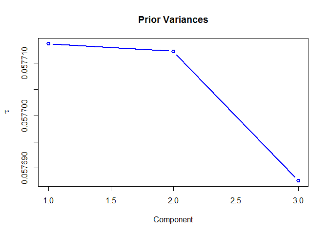
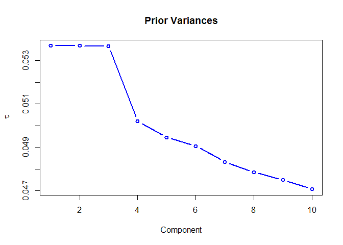
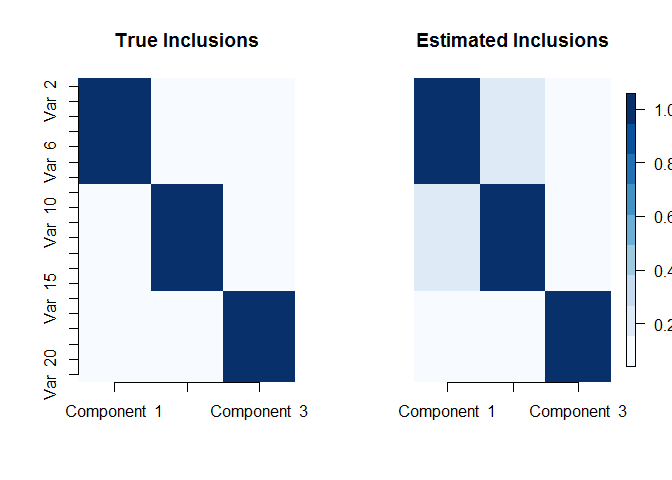
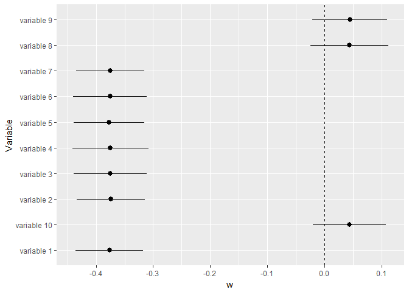

bayespca Package
================
Davide Vidotto <d.vidotto@uvt.nl>
2019-08-12

-   [bayespca: A package for Variational Bayes PCA](#bayespca-a-package-for-variational-bayes-pca)
    -   [Theoretical background](#theoretical-background)
    -   [The `bayespca` package](#the-bayespca-package)
    -   [Levels of regularization on the W matrix](#levels-of-regularization-on-the-w-matrix)
        -   [Fixed `tau`](#fixed-tau)
        -   [Fixed, updatable `tau`](#fixed-updatable-tau)
        -   [Random `tau`: Jeffrey's prior](#random-tau-jeffreys-prior)
        -   [Random `tau`: Inverse Gamma prior](#random-tau-inverse-gamma-prior)
        -   [Random `tau`, random `betatau`](#random-tau-random-betatau)
        -   [Global prior variances](#global-prior-variances)
    -   [Stochastic Search Variable Selection](#stochastic-search-variable-selection)
    -   [High posterior density intervals](#high-posterior-density-intervals)
    -   [Retrieve Principal Components](#retrieve-principal-components)
        -   [References](#references)

<style type="text/css">
.main-container {
  max-width: 1800px;
  margin-left: auto;
  margin-right: auto;
}
</style>
bayespca: A package for Variational Bayes PCA
=============================================

Theoretical background
----------------------

Principal Components Analysis (PCA) allows performing dimensionality reduction via matrix factorization. While there are several ways to express a PCA model, in what follows will we consider the formulation
*X* = *X**W**P*<sup>*T*</sup> + *E*,
 where X is a *I* × *J* data matrix (*I* is the number of units; *J* the number of continuous variables); *W* is a *J* × *D* weight matrix (*D* ≤ *J* is the rank of the reduced matrix); *P* is the orthogonal loading matrix, such that *P*<sup>*T*</sup>*P* = *I*<sub>*D* × *D*</sub>; and *E* is an *I* × *J* error matrix. The *D* principal components can be retrieved with *Z* = *X**W*. In this context, the focus of the inference is typically on *W*. In particular, when *J* is large and the main inferential goal is components' interpretation, it is important for the analyst to obtain simple and interpretable components.

The `bayespca` package allows performing the following operations:

1.  estimation of the PCA model, with a Variational Bayes algorithm;
2.  regularization of the elements of *W* by means of its prior variances;
3.  variable selection, via a Stochastic Search Variable Selection method (a form of "spike-and-slab" prior).

The Variational Bayes algorithm sees the columns of *W* as latent variables, and *P* as a fixed parameter. Furthermore, the residuals *E* are assumed to be distributed according to a Normal distribution with mean 0 and variance *σ*<sup>2</sup>. The following prior is assumed for the *d*-th column of *W*:

*w*<sub>*d*</sub> ∼ *M**V**N*(0, *T*<sub>*d*</sub>)

where *M**V**N*() denotes the density of the Multivariate Normal Matrix, and *T*<sub>*d*</sub> denotes the prior (diagonal) covariance matrix of the *d*-th component. The *j*-th element of the diagonal of *T*<sub>*d*</sub> will be denoted *τ*<sub>*d**j*</sub>.

The `bayespca` package
----------------------

Variational Bayes PCA is implemented through the `vbpca` function, which takes the following arguments as inputs:

-   `X` the input matrix;
-   `D` the number of components to be estimated;
-   `maxIter` the maximum number of iterations for the Variational Bayes algorithm;
-   `tolerance` convergence criterion of the algorithm (relative difference between ELBO values);
-   `verbose` logical parameter which prints estimation information on screen when `TRUE`;
-   `tau` value of the prior variances; starting value when `updatetau=TRUE` or `priorvar!='fixed'`
-   `updatetau` logical parameter denoting whether the prior variances should be updated when `priorvar='fixed'`;
-   `priorvar` character argument denoting whether the prior variances should be `'fixed'`, or random with `'jeffrey'` or `'invgamma'` priors;
-   `SVS` logical argument which activates Stochastic Variable Selection when set to `TRUE`;
-   `priorInclusion` prior inclusion probabilities for the elements of *W* in the model;
-   `global.var` logical parameter which activates component-specific prior variances when set to `TRUE`;
-   `control` other control parameters, such as Inverse Gamma hyperparameters (see `?vbpca_control` for more information).

`vbpca` returns a vbpca object, which is a list containing various aspect of the model results. See `?vbpca` for further information. Internally, `vbpca` calls a C++ function (written with Rcpp) to estimate the model.

In what follows, the various estimation modalities allowed by `vbpca` will be introduced. For presentation purposes, a synthetic data matrix with *I* = 100 rows and *J* = 20 columns genereted from three components will be used:

``` r
set.seed(141)
I <- 100
J <- 20 
V1 <- rnorm(I, 0, 50)
V2 <- rnorm(I, 0, 30)
V3 <- rnorm(I, 0, 10)
X <- matrix(c(rep(V1, 7), rep(V2, 7), rep(V3, 6)), I, J)
X <- X + matrix(rnorm(I * J, 0, 1), I, J)
```

I will now proceed with the estimation of the PCA model.

Levels of regularization on the W matrix
----------------------------------------

### Fixed `tau`

With fixed tau, it is possible to specify the model as follows:

``` r
# Install and load package 
# devtools::install_github("davidevdt/bayespca")
library(bayespca)


# De-activate data center and scaling;
ctrl <- vbpca_control(center = FALSE, scalecorrection = -1, 
                      plot.lowerbound = FALSE)


# Estimate vbpca with fixed prior variances (equal to 1) 
# for the elements of W 
mod1 <- vbpca(X, D = 3, maxIter = 1e+03, priorvar = 'fixed', 
              control = ctrl, verbose = FALSE )
```

    ## Warning: unscaled data - ELBO values might be positive.

``` r
# Test the class of mod1: 
is.vbpca(mod1)
```

    ## [1] TRUE

The estimate posterior means of the *W* matrix can be viewed with:

``` r
mod1$muW 
```

    ##              Component 1 Component 2   Component 3
    ## variable 1  -0.376589697 -0.04416511  0.0003399127
    ## variable 2  -0.373939776 -0.04582346 -0.0111489577
    ## variable 3  -0.375148656 -0.04305857 -0.0078831833
    ## variable 4  -0.374770076 -0.04473100 -0.0031124936
    ## variable 5  -0.376808025 -0.04285791 -0.0100250666
    ## variable 6  -0.375114064 -0.04446329 -0.0015012122
    ## variable 7  -0.375069345 -0.04364081 -0.0007181137
    ## variable 8   0.043916073 -0.37610684 -0.0194987814
    ## variable 9   0.044338996 -0.37382689 -0.0224165501
    ## variable 10  0.043216238 -0.37319455 -0.0161965551
    ## variable 11  0.043432789 -0.37311089 -0.0246530479
    ## variable 12  0.045420158 -0.37574266 -0.0200072027
    ## variable 13  0.045158091 -0.37616395 -0.0206149535
    ## variable 14  0.044605650 -0.37571347 -0.0144837510
    ## variable 15  0.002905219  0.02229238 -0.4057459196
    ## variable 16  0.003409761  0.02199152 -0.4068881251
    ## variable 17  0.003232844  0.02063894 -0.4106993259
    ## variable 18  0.002919709  0.02319335 -0.4056784549
    ## variable 19  0.002019259  0.02192116 -0.4088023613
    ## variable 20  0.001874207  0.02043128 -0.4078307380

and the *P* matrix:

``` r
mod1$P 
```

    ##              Component 1 Component 2   Component 3
    ## variable 1  -0.376589904 -0.04416517  0.0003399179
    ## variable 2  -0.373939981 -0.04582353 -0.0111491289
    ## variable 3  -0.375148862 -0.04305863 -0.0078833043
    ## variable 4  -0.374770282 -0.04473106 -0.0031125414
    ## variable 5  -0.376808232 -0.04285797 -0.0100252205
    ## variable 6  -0.375114270 -0.04446335 -0.0015012352
    ## variable 7  -0.375069551 -0.04364087 -0.0007181247
    ## variable 8   0.043916097 -0.37610735 -0.0194990808
    ## variable 9   0.044339020 -0.37382740 -0.0224168943
    ## variable 10  0.043216262 -0.37319506 -0.0161968038
    ## variable 11  0.043432813 -0.37311139 -0.0246534264
    ## variable 12  0.045420183 -0.37574317 -0.0200075099
    ## variable 13  0.045158115 -0.37616446 -0.0206152700
    ## variable 14  0.044605675 -0.37571398 -0.0144839734
    ## variable 15  0.002905220  0.02229241 -0.4057521497
    ## variable 16  0.003409762  0.02199155 -0.4068943728
    ## variable 17  0.003232846  0.02063897 -0.4107056321
    ## variable 18  0.002919710  0.02319338 -0.4056846840
    ## variable 19  0.002019260  0.02192119 -0.4088086384
    ## variable 20  0.001874208  0.02043131 -0.4078370001

Among other things, the function returns the model evidence lower bound (ELBO) and the estimation time:

``` r
mod1$elbo 
```

    ## [1] -2834.329

``` r
mod1$time 
```

    ##    user  system elapsed 
    ##       0       0       0

### Fixed, updatable `tau`

The prior variances *τ*<sub>*d**j*</sub> can also be updated via Type-II Maximum Likelihood (empirical Bayes updates):

``` r
mod2 <- vbpca(X, D = 3, maxIter = 1e+03, priorvar = 'fixed',
              updatetau = TRUE, control = ctrl, verbose = FALSE )
```

    ## Warning: unscaled data - ELBO values might be positive.

``` r
mod2$muW
```

    ##               Component 1  Component 2  Component 3
    ## variable 1  -3.770417e-01 -0.051573499 -0.001788633
    ## variable 2  -3.747997e-01 -0.025120541 -0.002279085
    ## variable 3  -3.749896e-01 -0.039169668 -0.002284711
    ## variable 4  -3.695986e-01 -0.062446420 -0.002188222
    ## variable 5  -3.798267e-01 -0.031100065 -0.002172447
    ## variable 6  -3.809607e-01 -0.058646546 -0.001863930
    ## variable 7  -3.707615e-01 -0.037076450 -0.001858450
    ## variable 8   4.610643e-02 -0.388243166 -0.019761887
    ## variable 9   4.122547e-02 -0.376699340 -0.023207406
    ## variable 10  2.542203e-02 -0.376987920 -0.006935656
    ## variable 11  5.233439e-02 -0.374340986 -0.022206305
    ## variable 12  4.536997e-02 -0.374395905 -0.013879307
    ## variable 13  6.378896e-02 -0.370090650 -0.031591876
    ## variable 14  3.106493e-02 -0.364598986 -0.002519184
    ## variable 15  5.847012e-06  0.006198051 -0.406003865
    ## variable 16  6.041405e-06  0.018464891 -0.407039992
    ## variable 17  5.235991e-06  0.009013294 -0.411151002
    ## variable 18  3.518425e-06  0.036121023 -0.398782724
    ## variable 19  6.288835e-06  0.005824170 -0.410563013
    ## variable 20  6.214579e-06  0.034945874 -0.412808540

The matrix of the inverse prior variances can be called with

``` r
mod2$invTau
```

    ##              Component 1 Component 2  Component 3
    ## variable 1  6.723601e+00  184.301092 31906.370412
    ## variable 2  6.797876e+00  437.595910 25321.510608
    ## variable 3  6.720477e+00  245.899700 25234.633839
    ## variable 4  6.909797e+00  136.385519 26302.854255
    ## variable 5  6.614756e+00  336.071864 26671.584545
    ## variable 6  6.538464e+00  150.961175 30414.866200
    ## variable 7  6.920149e+00  278.098092 30606.846242
    ## variable 8  1.973803e+02    6.278101   670.761526
    ## variable 9  2.288287e+02    6.657350   569.759379
    ## variable 10 4.149292e+02    6.642324  1989.950540
    ## variable 11 1.699204e+02    6.739745   597.851184
    ## variable 12 2.026152e+02    6.706750   970.392618
    ## variable 13 1.292935e+02    6.822902   390.944658
    ## variable 14 3.536290e+02    7.210202  5658.371090
    ## variable 15 3.158381e+05 2396.464628     5.835080
    ## variable 16 3.162767e+05  757.091274     5.769939
    ## variable 17 3.264009e+05 1565.810035     5.674352
    ## variable 18 3.196566e+05  348.615143     5.995065
    ## variable 19 3.198439e+05 2526.927987     5.707424
    ## variable 20 3.182544e+05  363.292432     5.588104

### Random `tau`: Jeffrey's prior

By assuming Jeffrey's hyperpriors on *τ*<sub>*d*, *j*</sub> we set:

$$ p(\\tau\_{d,j}) \\propto \\frac{1}{\\tau\_{d,j}}.  $$

The following code runs the algorithm with Jeffrey's priors on `tau`:

``` r
mod3 <- vbpca(X, D = 3, maxIter = 1e+03, 
              priorvar = 'jeffrey', control = ctrl, verbose = FALSE )
```

    ## Warning: unscaled data - ELBO values might be positive.

``` r
mod3$muW
```

    ##               Component 1  Component 2  Component 3
    ## variable 1  -3.757646e-01 -0.051773160 -0.001684598
    ## variable 2  -3.756863e-01 -0.024773150 -0.002122048
    ## variable 3  -3.758101e-01 -0.039042545 -0.002125161
    ## variable 4  -3.692192e-01 -0.062594644 -0.002042117
    ## variable 5  -3.808786e-01 -0.030957878 -0.002028616
    ## variable 6  -3.802877e-01 -0.058870639 -0.001748039
    ## variable 7  -3.703552e-01 -0.036931472 -0.001746713
    ## variable 8   4.721080e-02 -0.388387203 -0.019681028
    ## variable 9   4.143813e-02 -0.376808913 -0.023157487
    ## variable 10  2.659771e-02 -0.377040717 -0.006727279
    ## variable 11  5.011560e-02 -0.374286630 -0.022163915
    ## variable 12  4.536128e-02 -0.374432238 -0.013520621
    ## variable 13  6.304093e-02 -0.370068016 -0.031431258
    ## variable 14  3.134111e-02 -0.364405736 -0.002414999
    ## variable 15 -1.171811e-05  0.005936644 -0.406010842
    ## variable 16 -1.146225e-05  0.018071121 -0.406913644
    ## variable 17 -1.192092e-05  0.008654023 -0.411149650
    ## variable 18 -1.359439e-05  0.036363148 -0.398751160
    ## variable 19 -1.127322e-05  0.005569321 -0.410649936
    ## variable 20 -1.140226e-05  0.034939861 -0.412915798

``` r
mod3$invTau 
```

    ##              Component 1 Component 2  Component 3
    ## variable 1  6.767590e+00  183.413237 35792.389870
    ## variable 2  6.767276e+00  444.807011 28717.737815
    ## variable 3  6.692741e+00  246.914788 28653.864298
    ## variable 4  6.923187e+00  135.973349 29770.336740
    ## variable 5  6.579887e+00  337.917431 30166.978285
    ## variable 6  6.560514e+00  150.229799 34271.225139
    ## variable 7  6.934665e+00  279.497089 34407.243746
    ## variable 8  1.915903e+02    6.273751   676.164204
    ## variable 9  2.275212e+02    6.653730   573.008331
    ## variable 10 3.946490e+02    6.640583  2059.789146
    ## variable 11 1.794492e+02    6.741653   601.092050
    ## variable 12 2.026344e+02    6.705600  1000.451289
    ## variable 13 1.312116e+02    6.823768   394.628449
    ## variable 14 3.499053e+02    7.217607  5917.649067
    ## variable 15 3.510386e+05 2512.207931     5.834906
    ## variable 16 3.515804e+05  778.039953     5.773433
    ## variable 17 3.627243e+05 1637.770072     5.674439
    ## variable 18 3.549667e+05  347.219129     5.996028
    ## variable 19 3.555498e+05 2652.878683     5.705122
    ## variable 20 3.539059e+05  364.874639     5.585392

### Random `tau`: Inverse Gamma prior

It is possible to specify an inverse gamma prior on *τ*<sub>*d*, *j*</sub>:

*τ*<sub>*d*, *j*</sub> ∼ *I**G*(*α*, *β*)

with *α* shape parameter and *β* scale parameter. The following code implements an IG(2, .5) prior on the variances:

``` r
# Set hyperparameter values 
ctrl2 <- vbpca_control(center = FALSE, scalecorrection = -1,
                       plot.lowerbound = FALSE, 
                       alphatau = 2, betatau = .5)
                       
                       
                       
# Estimate the model 
mod4 <- vbpca(X, D = 3, maxIter = 1e+03, priorvar = 'invgamma', 
              control = ctrl2, verbose = FALSE )
```

    ## Warning: unscaled data - ELBO values might be positive.

``` r
mod4$muW 
```

    ##              Component 1 Component 2   Component 3
    ## variable 1  -0.376590647 -0.04416831  0.0002942783
    ## variable 2  -0.373916145 -0.04580796 -0.0111136115
    ## variable 3  -0.375152371 -0.04306335 -0.0078482119
    ## variable 4  -0.374771589 -0.04473679 -0.0031289018
    ## variable 5  -0.376819230 -0.04285286 -0.0099901143
    ## variable 6  -0.375128398 -0.04445794 -0.0015202569
    ## variable 7  -0.375056419 -0.04365149 -0.0007404096
    ## variable 8   0.043918311 -0.37612413 -0.0195192789
    ## variable 9   0.044336971 -0.37380675 -0.0224249935
    ## variable 10  0.043215376 -0.37316095 -0.0162247651
    ## variable 11  0.043435543 -0.37309948 -0.0245954650
    ## variable 12  0.045416531 -0.37575287 -0.0200104086
    ## variable 13  0.045161134 -0.37621159 -0.0206043931
    ## variable 14  0.044602975 -0.37569136 -0.0144839228
    ## variable 15  0.002901088  0.02228831 -0.4056882953
    ## variable 16  0.003405222  0.02198276 -0.4068836318
    ## variable 17  0.003228802  0.02064986 -0.4107113728
    ## variable 18  0.002920826  0.02319232 -0.4056318015
    ## variable 19  0.002018519  0.02191736 -0.4087805942
    ## variable 20  0.001885975  0.02043594 -0.4078297610

``` r
mod4$invTau
```

    ##             Component 1 Component 2 Component 3
    ## variable 1     4.349513    4.952224    4.961845
    ## variable 2     4.357094    4.951479    4.961185
    ## variable 3     4.348866    4.946652    4.955442
    ## variable 4     4.346970    4.942133    4.951918
    ## variable 5     4.346201    4.949399    4.957941
    ## variable 6     4.348419    4.945415    4.955085
    ## variable 7     4.353566    4.952076    4.961437
    ## variable 8     4.940075    4.341259    4.947637
    ## variable 9     4.943619    4.350731    4.950784
    ## variable 10    4.946272    4.354243    4.954138
    ## variable 11    4.941374    4.350682    4.947635
    ## variable 12    4.939956    4.342697    4.948068
    ## variable 13    4.934268    4.336865    4.942105
    ## variable 14    4.953804    4.353473    4.962576
    ## variable 15    4.963713    4.961313    4.266473
    ## variable 16    4.954953    4.952599    4.256391
    ## variable 17    4.956272    4.954215    4.246050
    ## variable 18    4.953989    4.951371    4.259347
    ## variable 19    4.962076    4.959717    4.256072
    ## variable 20    4.950147    4.948089    4.249971

`alphatau` and `betatau` can also be specified as *D*-dimensional array, in which case the Inverse Gamma will have component-specific hyperparameters:
*τ*<sub>*d*, *j*</sub> ∼ *I**G*(*α*<sub>*d*</sub>, *β*<sub>*d*</sub>)
.

``` r
# Set hyperparameter values 
ctrl3 <- vbpca_control(center = FALSE, scalecorrection = -1,
                       plot.lowerbound = FALSE, 
                       alphatau = c(.5, 50, 3), betatau = c(.5, .01, 10), 
                       hypertype = 'component')
                       
                       
# Estimate the model 
mod5 <- vbpca(X, D = 3, maxIter = 1e+03, priorvar = 'invgamma', 
              control = ctrl3, verbose = FALSE )
```

    ## Warning: unscaled data - ELBO values might be positive.

``` r
mod5$muW 
```

    ##              Component 1  Component 2   Component 3
    ## variable 1  -0.378543478 -0.022403852  0.0025386295
    ## variable 2  -0.376019722 -0.021196983 -0.0088612115
    ## variable 3  -0.377066494 -0.022557126 -0.0057270031
    ## variable 4  -0.376774699 -0.022650241 -0.0008814042
    ## variable 5  -0.378720012 -0.022357681 -0.0078768015
    ## variable 6  -0.377102619 -0.019528818  0.0007032582
    ## variable 7  -0.376989874 -0.026248142  0.0014710887
    ## variable 8   0.021470521 -0.045359009 -0.0012343390
    ## variable 9   0.022018693 -0.049787441 -0.0042453561
    ## variable 10  0.020952041 -0.037610876  0.0018996414
    ## variable 11  0.021150966 -0.048838642 -0.0065159768
    ## variable 12  0.022990213 -0.048959831 -0.0017490218
    ## variable 13  0.022694280 -2.350959262 -0.0024775177
    ## variable 14  0.022197501 -0.048663411  0.0037657268
    ## variable 15  0.002988814  0.002048412 -0.4063509956
    ## variable 16  0.003472519 -0.001954198 -0.4074615231
    ## variable 17  0.003201167  0.008962963 -0.4112475488
    ## variable 18  0.003059452  0.006509927 -0.4063451138
    ## variable 19  0.002074293  0.003760222 -0.4093932228
    ## variable 20  0.001853458 -0.003935007 -0.4083201342

``` r
mod5$invTau 
```

    ##             Component 1 Component 2 Component 3
    ## variable 1     1.734909  4885.51101   0.3498302
    ## variable 2     1.737796  4897.91867   0.3498294
    ## variable 3     1.734283  4883.57903   0.3498025
    ## variable 4     1.733024  4882.65984   0.3497829
    ## variable 5     1.733356  4885.97064   0.3498127
    ## variable 6     1.733921  4914.16337   0.3497986
    ## variable 7     1.736550  4841.25146   0.3498290
    ## variable 8     1.974069  4535.17321   0.3497716
    ## variable 9     1.975981  4450.34973   0.3497902
    ## variable 10    1.977182  4671.07826   0.3498009
    ## variable 11    1.974679  4468.90214   0.3497765
    ## variable 12    1.974249  4466.51594   0.3497748
    ## variable 13    1.971273    18.20417   0.3497460
    ## variable 14    1.981100  4472.66011   0.3498376
    ## variable 15    1.982219  5007.34354   0.3469767
    ## variable 16    1.977733  5007.36672   0.3469196
    ## variable 17    1.978365  4988.53185   0.3468718
    ## variable 18    1.977266  4997.70264   0.3469310
    ## variable 19    1.981324  5004.97797   0.3469253
    ## variable 20    1.975283  5004.39805   0.3468847

Notice the different level of regularization obtained across the different components. In order to activate these 'component-specific' hyperpriors, `hypertype = 'component'` was specified.

### Random `tau`, random `betatau`

It is also possible to specify a Gamma hyperprior on *β* (while *α* remains fixed):
*β* ∼ *G**a*(*γ*, *δ*).
 This is achievable by setting `gammatau` (and `deltatau`) larger than 0 in the control parameters:

``` r
# Specify component-specific Gamma(.01, 10) hyperpriors on betatau 
ctrl4 <- vbpca_control(center = FALSE, scalecorrection = -1, 
                       plot.lowerbound = FALSE, 
                       alphatau = 1, betatau = 1,
                       gammatau = .01, deltatau = 10, 
                       hypertype = 'component')

                       
# Estimate the model 
mod6 <- vbpca(X, D = 3, maxIter = 1e+03, priorvar = 'invgamma', 
              control = ctrl4, verbose = FALSE )
```

    ## Warning: unscaled data - ELBO values might be positive.

``` r
mod6$muW 
```

    ##              Component 1 Component 2  Component 3
    ## variable 1  -0.376611437 -0.04414830 -0.001252671
    ## variable 2  -0.373522305 -0.04527018 -0.009487805
    ## variable 3  -0.375303126 -0.04330237 -0.006687095
    ## variable 4  -0.374545174 -0.04476030 -0.003779739
    ## variable 5  -0.377135323 -0.04290004 -0.008530456
    ## variable 6  -0.375471472 -0.04449079 -0.002519439
    ## variable 7  -0.374841518 -0.04378470 -0.001756540
    ## variable 8   0.044091734 -0.37646021 -0.020075478
    ## variable 9   0.044279171 -0.37340282 -0.022181983
    ## variable 10  0.043230863 -0.37275698 -0.017353060
    ## variable 11  0.043633682 -0.37285414 -0.022657108
    ## variable 12  0.045225592 -0.37597481 -0.020153766
    ## variable 13  0.045217385 -0.37690958 -0.020321214
    ## variable 14  0.044311525 -0.37546975 -0.014960798
    ## variable 15  0.002829728  0.02204140 -0.405116611
    ## variable 16  0.003208895  0.02187057 -0.407344521
    ## variable 17  0.003155312  0.02095411 -0.410909109
    ## variable 18  0.002824576  0.02288662 -0.405229626
    ## variable 19  0.002136107  0.02174443 -0.408747297
    ## variable 20  0.002177548  0.02077097 -0.407952211

``` r
mod6$invTau 
```

    ##             Component 1 Component 2 Component 3
    ## variable 1     14.89847    49.95597    64.79114
    ## variable 2     15.06380    49.85157    64.48104
    ## variable 3     14.87935    49.45351    63.73992
    ## variable 4     14.89953    49.19672    63.74737
    ## variable 5     14.83146    49.84022    64.32954
    ## variable 6     14.87624    49.45017    63.91513
    ## variable 7     14.97986    49.94842    64.56200
    ## variable 8     48.95314    14.77489    62.76748
    ## variable 9     49.16960    14.97374    62.96668
    ## variable 10    49.41724    15.02556    63.45826
    ## variable 11    49.04970    14.98706    62.69018
    ## variable 12    48.92027    14.79264    62.77075
    ## variable 13    48.53974    14.68576    62.16584
    ## variable 14    50.07132    15.00763    64.71429
    ## variable 15    51.73889    51.41043    14.14011
    ## variable 16    51.12230    50.69433    13.94199
    ## variable 17    51.27494    50.94174    13.77126
    ## variable 18    51.01890    50.58728    14.03940
    ## variable 19    51.71281    51.34808    13.93690
    ## variable 20    50.73849    50.38297    13.85877

The posterior means of *β* can be accessed via

``` r
mod6$priorBeta 
```

    ##            [,1]       [,2]       [,3]
    ## [1,] 0.02643281 0.02638618 0.02076472
    ## attr(,"names")
    ## [1] "beta 1" "beta 2" "beta 3"

`hypertype` specify the type of hyperprior for `beta`:

-   `'common'` implies *β* ∼ *G**a*(*α*, *β*);
-   `'component'` implies *β*<sub>*d*</sub> ∼ *G**a*(*α*<sub>*d*</sub>, *β*<sub>*d*</sub>);
-   `'local'` implies *β*<sub>*d**j*</sub> ∼ *G**a*(*α*<sub>*d**j*</sub>, *β*<sub>*d**j*</sub>).

Similar to `alphatau` and `betatau`, `gammatau` and `deltatau` can also be *D*-dimensional arrays for component-specific hyperpriors on *β*.

### Global prior variances

So far, the parameter `global.var` has always ben set to `FALSE`, implying
*w*<sub>*j*, *d*</sub> ∼ *N*(0, *τ*<sub>*j*, *d*</sub>).
 Setting `global.var = TRUE` will modify this formulation, which will switch to
*w*<sub>*j*, *d*</sub> ∼ *N*(0, *τ*<sub>*d*</sub>)
 that is, component-specific variances (called 'global variances' in `vbpca`) will be estimated instead:

``` r
# Fixed prior global variances, updated via Type-II maximum likelihood: 
mod7 <- vbpca(X, D = 3, maxIter = 1e+03, priorvar = 'fixed',
              updatetau = TRUE, control = ctrl, verbose = FALSE, 
              global.var = TRUE)
```

    ## Warning: unscaled data - ELBO values might be positive.



``` r
mod7$muW 
```

    ##              Component 1 Component 2   Component 3
    ## variable 1  -0.376586343 -0.04416414  0.0003398280
    ## variable 2  -0.373936445 -0.04582246 -0.0111461792
    ## variable 3  -0.375145315 -0.04305763 -0.0078812187
    ## variable 4  -0.374766738 -0.04473002 -0.0031117179
    ## variable 5  -0.376804669 -0.04285697 -0.0100225682
    ## variable 6  -0.375110723 -0.04446231 -0.0015008380
    ## variable 7  -0.375066004 -0.04363985 -0.0007179347
    ## variable 8   0.043915682 -0.37609858 -0.0194939220
    ## variable 9   0.044338601 -0.37381868 -0.0224109636
    ## variable 10  0.043215853 -0.37318635 -0.0161925187
    ## variable 11  0.043432402 -0.37310269 -0.0246469040
    ## variable 12  0.045419753 -0.37573441 -0.0200022167
    ## variable 13  0.045157688 -0.37615568 -0.0206098160
    ## variable 14  0.044605253 -0.37570521 -0.0144801414
    ## variable 15  0.002905193  0.02229189 -0.4056448021
    ## variable 16  0.003409730  0.02199104 -0.4067867230
    ## variable 17  0.003232816  0.02063848 -0.4105969740
    ## variable 18  0.002919683  0.02319284 -0.4055773542
    ## variable 19  0.002019241  0.02192068 -0.4087004821
    ## variable 20  0.001874190  0.02043083 -0.4077291009

``` r
mod7$invTau 
```

    ## [1] 17.32691 17.32734 17.33475

Notice the plot of the prior variances (inverse precisions) that appears in this case. This is useful when the number of components supported by the data is uncertain (elbow method - see Figure 2):

``` r
mod8 <- vbpca(X, D = 10, maxIter = 1e+03, priorvar = 'fixed',
              updatetau = TRUE, global.var = TRUE, 
              control = ctrl, verbose = FALSE )
```

    ## Warning: unscaled data - ELBO values might be positive.



Stochastic Search Variable Selection
------------------------------------

By requiring `SVS = TRUE`, the model activates stochastic-search-variable-selection, a method described by George ad McCulloch (1993) for the Gibbs Sampler. The method has been adapted in *bayespca* for the Variational Bayes algorithm. The assumed 'spike-and-slab' prior for the (*j*, *d*)-th element of *W* becomes:

*w*<sub>*j*, *d*</sub> ∼ *N*(0, *π**τ* + (1 − *π*)*τ**v*<sub>0</sub>)

where *v*<sub>0</sub> is a scalar which rescales the spike variance to a value close to 0. For this reason, *v*<sub>0</sub> should be a number included in (0, 1), as close as possible to 0. *π* represents the prior probability of inclusion of the *j*-th variable in the *d*-th component of the model. `vbpca` estimates the posterior probabilities of inclusion, conditional on *X* and the values in *W*.

While *v*<sub>0</sub> should be a small value close to 0, too small values of such parameter will shrink the variances *τ* too much, and no variable will eventually be included in the model. On the other hand, using a too large value for *v*<sub>0</sub> will not shrink the variances enough, and all posterior inclusion probabilities will be close to 1. *v*<sub>0</sub> should then be set with a grain of salt. Preliminary results from partial simulation studies have shown that values between 0.0001 and 0.005 lead to acceptable results, but adequate values of *v*<sub>0</sub> can be dataset-specific. Preliminary simulation studies have also shown that the method works better when Inverse Gamma priors are specified for *τ*.

In `vbpca`, the parameter *v*<sub>0</sub> is called `v0` in the control parameters of `vbpca_control`, while the prior inclusion probability is called `priorInclusion`. `priorInclusion` can be fixed, or assigned to a Beta hyperprior:

-   among the control parameters of `vbpca_control`, set `beta1pi` smaller than or equal to 0 for fixed *π*;
-   last, set `beta1pi` larger than 0 for Beta specifications.

When `beta1pi` is larger than 0, a Beta prior is assumed for *π*:

*π* ∼ *B**e**t**a*(*β*<sub>1</sub>, *β*<sub>2</sub>).

In `vbpca`, *β*1 can be controlled with the `beta1pi` argument and *β*2 with the `beta2pi` argument in `vbpca_control`.

``` r
# SVS, fixed priorInclusion and InverseGamma(5, 1) for tau, v0 = .005
ctrl5 <- vbpca_control(center = FALSE, scalecorrection = -1, 
                       plot.lowerbound = FALSE, 
                       alphatau = 5, betatau = 1,
                       beta1pi = -1, v0 = 5e-03)

# Estimate the model with priorInclusion = 0.5
mod9 <- vbpca(X, D = 3, maxIter = 1e+03, priorvar = 'invgamma',
              SVS = TRUE, priorInclusion = 0.5, control = ctrl5,
              verbose = FALSE )                    
```

    ## Warning: unscaled data - ELBO values might be positive.

``` r
mod9$muW 
```

    ##              Component 1 Component 2  Component 3
    ## variable 1  -0.376750692 -0.04448495 -0.004123683
    ## variable 2  -0.372459887 -0.04361185 -0.005752993
    ## variable 3  -0.375671975 -0.04356723 -0.004989270
    ## variable 4  -0.373836916 -0.04448097 -0.004703139
    ## variable 5  -0.377543656 -0.04319604 -0.005454948
    ## variable 6  -0.375846023 -0.04472475 -0.004528453
    ## variable 7  -0.375420482 -0.04399690 -0.004254785
    ## variable 8   0.044408056 -0.37704714 -0.019871878
    ## variable 9   0.043996739 -0.37297274 -0.020136604
    ## variable 10  0.043266209 -0.37568704 -0.019144528
    ## variable 11  0.043855992 -0.37127741 -0.019779142
    ## variable 12  0.044744851 -0.37518584 -0.019753061
    ## variable 13  0.045169754 -0.37455442 -0.019722877
    ## variable 14  0.043743494 -0.37734332 -0.018263649
    ## variable 15  0.002622365  0.02125415 -0.405655204
    ## variable 16  0.002687542  0.02139614 -0.407985339
    ## variable 17  0.002847711  0.02135195 -0.409082736
    ## variable 18  0.002536920  0.02132424 -0.406350545
    ## variable 19  0.002543555  0.02126640 -0.408688107
    ## variable 20  0.002678762  0.02114151 -0.408155324

``` r
# SVS, priorInclusion with Beta(1,1) priors and InverseGamma(5, 1) for tau, v0 = .005
ctrl6 <- vbpca_control(center = FALSE, scalecorrection = -1,
                       plot.lowerbound = FALSE, alphatau = 5,
                       betatau = 1, beta1pi = 1, beta2pi = 1, 
                       v0 = 5e-03)

                       
# Estimate the model
mod10 <- vbpca(X, D = 3, maxIter = 1e+03, priorvar = 'invgamma', 
              SVS = TRUE, priorInclusion = 0.5, control = ctrl6,
              verbose = FALSE ) 
```

    ## Warning: unscaled data - ELBO values might be positive.

``` r
mod10$muW             
```

    ##              Component 1 Component 2  Component 3
    ## variable 1  -0.376822359 -0.04443398 -0.004109768
    ## variable 2  -0.372328083 -0.04358486 -0.005697092
    ## variable 3  -0.375718964 -0.04343662 -0.004948000
    ## variable 4  -0.373892377 -0.04418091 -0.004672944
    ## variable 5  -0.377499109 -0.04329908 -0.005404668
    ## variable 6  -0.375807941 -0.04448106 -0.004504394
    ## variable 7  -0.375544858 -0.04396978 -0.004237243
    ## variable 8   0.044271095 -0.37708802 -0.019690231
    ## variable 9   0.043950383 -0.37295019 -0.019941871
    ## variable 10  0.043386809 -0.37576101 -0.018993548
    ## variable 11  0.043790212 -0.37125654 -0.019594262
    ## variable 12  0.044484806 -0.37516461 -0.019574768
    ## variable 13  0.044626823 -0.37452381 -0.019541476
    ## variable 14  0.043969795 -0.37746756 -0.018158242
    ## variable 15  0.002608063  0.02107548 -0.405654813
    ## variable 16  0.002664289  0.02120215 -0.407997771
    ## variable 17  0.002842474  0.02116027 -0.409084318
    ## variable 18  0.002533667  0.02111672 -0.406361538
    ## variable 19  0.002532533  0.02108313 -0.408694850
    ## variable 20  0.002668084  0.02094053 -0.408182581

The estimated posterior inclusion probabilities for the two models:

``` r
mod9$inclusionProbabilities
```

    ##             Component 1 Component 2 Component 3
    ## variable 1   1.00000000   0.2120296  0.09726907
    ## variable 2   1.00000000   0.2068326  0.09851144
    ## variable 3   1.00000000   0.2084065  0.09897047
    ## variable 4   1.00000000   0.2139049  0.09843787
    ## variable 5   1.00000000   0.2044355  0.09823061
    ## variable 6   1.00000000   0.2146309  0.09848977
    ## variable 7   1.00000000   0.2091004  0.09793821
    ## variable 8   0.21428441   1.0000000  0.11723947
    ## variable 9   0.21111001   1.0000000  0.11752795
    ## variable 10  0.20612101   1.0000000  0.11542999
    ## variable 11  0.21070545   1.0000000  0.11707616
    ## variable 12  0.21594418   1.0000000  0.11702863
    ## variable 13  0.21982827   1.0000000  0.11758358
    ## variable 14  0.20661409   1.0000000  0.11227938
    ## variable 15  0.09660274   0.1179197  1.00000000
    ## variable 16  0.09702372   0.1193704  1.00000000
    ## variable 17  0.09668529   0.1185038  1.00000000
    ## variable 18  0.09705420   0.1192275  1.00000000
    ## variable 19  0.09635180   0.1178253  1.00000000
    ## variable 20  0.09741905   0.1191173  1.00000000

``` r
mod10$inclusionProbabilities
```

    ##             Component 1 Component 2 Component 3
    ## variable 1   1.00000000  0.14730263  0.06653994
    ## variable 2   1.00000000  0.14364325  0.06737536
    ## variable 3   1.00000000  0.14411230  0.06767053
    ## variable 4   1.00000000  0.14722150  0.06731669
    ## variable 5   1.00000000  0.14251464  0.06718462
    ## variable 6   1.00000000  0.14809154  0.06735101
    ## variable 7   1.00000000  0.14529510  0.06698563
    ## variable 8   0.14821716  1.00000000  0.08020103
    ## variable 9   0.14644948  1.00000000  0.08039501
    ## variable 10  0.14370665  1.00000000  0.07900339
    ## variable 11  0.14603752  1.00000000  0.08008490
    ## variable 12  0.14881097  1.00000000  0.08005841
    ## variable 13  0.15002809  1.00000000  0.08041359
    ## variable 14  0.14479154  1.00000000  0.07692516
    ## variable 15  0.06607344  0.08074737  1.00000000
    ## variable 16  0.06634741  0.08168749  1.00000000
    ## variable 17  0.06612518  0.08111261  1.00000000
    ## variable 18  0.06636951  0.08156753  1.00000000
    ## variable 19  0.06590500  0.08067578  1.00000000
    ## variable 20  0.06660968  0.08148491  1.00000000

It is also possible to compare the (known) variable inclusion matrix vs. the estimated ones graphically. Let's plot a heatmap of such probabilities for model `mod9`:

``` r
trueInclusions <- matrix(0, J, 3)
trueInclusions[1:7, 1] <- 1
trueInclusions[8:14, 2] <- 1 
trueInclusions[15:20, 3] <- 1

par(mfrow=c(1,2))
image(1:ncol(trueInclusions), 1:nrow(trueInclusions),  
      t(trueInclusions[J:1, ]), ylab = "", axes = FALSE, 
      main = "True Inclusions", xlab = "",
      col =  RColorBrewer::brewer.pal(9, "Blues"))
axis(side = 1, at = 1:3, labels = paste("Component ", 1:3 ))      
axis(side = 2, at = 1:20, labels = paste("Var ", J:1 )) 

fields::image.plot(1:ncol(trueInclusions), 1:nrow(trueInclusions),  
      t(mod9$inclusionProbabilities[J:1, ]), ylab = "", axes = FALSE, 
      main = "Estimated Inclusions", xlab = "",
      col = RColorBrewer::brewer.pal(9, "Blues"))  
axis(side = 1, at = 1:3, labels = paste("Component ", 1:3 ))          
```



We can observe the estimated prior inclusion probabilities for `mod10`:

``` r
mod10$priorInclusion
```

    ##           [,1]
    ## [1,] 0.4025554
    ## [2,] 0.4025554
    ## [3,] 0.4025554

Similar to the hyperparameters of the Inverse Gamma priors on *τ*, `priorInclusion`, `beta1pi` and `beta2pi` can also be specified as *D*-dimensional arrays. This will allow estimating the inclusion probabilities with different degrees of 'sparsity' for each component. For Beta priors, all elements of `beta1pi` must be larger than 0. Let us look at one example:

``` r
# Beta priors with different degrees of sparsity for each component 
ctrl7 <- vbpca_control(center = FALSE, scalecorrection = -1,
                       plot.lowerbound = FALSE, 
                       alphatau = 5, betatau = 1,
                       beta1pi = c(0.01, 1, 10), beta2pi = 1,
                       v0 = 5e-03)

                       
# Estimate the model
mod11 <- vbpca(X, D = 3, maxIter = 1e+03, priorvar = 'invgamma', SVS = TRUE,
              priorInclusion = rep(0.5, 3), control = ctrl7, verbose = FALSE )  
```

    ## Warning: unscaled data - ELBO values might be positive.

``` r
mod11$muW
```

    ##              Component 1 Component 2  Component 3
    ## variable 1  -0.376823553 -0.04445292 -0.004069605
    ## variable 2  -0.372321780 -0.04356864 -0.005750480
    ## variable 3  -0.375720588 -0.04342350 -0.004970829
    ## variable 4  -0.373891258 -0.04421414 -0.004669279
    ## variable 5  -0.377499571 -0.04325604 -0.005447522
    ## variable 6  -0.375807748 -0.04451895 -0.004487080
    ## variable 7  -0.375547731 -0.04396570 -0.004205898
    ## variable 8   0.044271252 -0.37708007 -0.019742308
    ## variable 9   0.043952908 -0.37296691 -0.020024420
    ## variable 10  0.043394060 -0.37573006 -0.018982397
    ## variable 11  0.043792974 -0.37126432 -0.019656898
    ## variable 12  0.044483312 -0.37518104 -0.019620517
    ## variable 13  0.044621267 -0.37454675 -0.019593263
    ## variable 14  0.043976056 -0.37743206 -0.018045949
    ## variable 15  0.002608530  0.02110045 -0.405681172
    ## variable 16  0.002664620  0.02123110 -0.407991414
    ## variable 17  0.002843244  0.02118633 -0.409091995
    ## variable 18  0.002534198  0.02114931 -0.406372349
    ## variable 19  0.002533170  0.02110874 -0.408700786
    ## variable 20  0.002668932  0.02097038 -0.408132057

``` r
mod11$priorInclusion
```

    ##           [,1]
    ## [1,] 0.3999559
    ## [2,] 0.4432304
    ## [3,] 0.5825461

``` r
mod11$inclusionProbabilities    
```

    ##             Component 1 Component 2 Component 3
    ## variable 1   1.00000000  0.17112197   0.1337330
    ## variable 2   1.00000000  0.16672704   0.1354631
    ## variable 3   1.00000000  0.16733858   0.1361515
    ## variable 4   1.00000000  0.17115717   0.1353939
    ## variable 5   1.00000000  0.16530310   0.1350775
    ## variable 6   1.00000000  0.17216159   0.1354701
    ## variable 7   1.00000000  0.16869081   0.1346833
    ## variable 8   0.14487471  1.00000000   0.1602905
    ## variable 9   0.14315770  1.00000000   0.1606833
    ## variable 10  0.14049548  1.00000000   0.1577618
    ## variable 11  0.14275404  1.00000000   0.1600890
    ## variable 12  0.14545003  1.00000000   0.1600062
    ## variable 13  0.14661853  1.00000000   0.1608249
    ## variable 14  0.14156091  1.00000000   0.1533005
    ## variable 15  0.06453304  0.09420471   1.0000000
    ## variable 16  0.06480003  0.09532060   1.0000000
    ## variable 17  0.06458335  0.09463845   1.0000000
    ## variable 18  0.06482151  0.09518785   1.0000000
    ## variable 19  0.06436869  0.09412224   1.0000000
    ## variable 20  0.06505576  0.09509410   1.0000000

High posterior density intervals
--------------------------------

It is also possible to require the computation of high probability density intervals for the elements of *W*, which can then be plotted with the `plothpdi` function, which internally calls `ggplot2` functionalities. *Note*: when normalised weights are require from the corresponding `vbpca_control` argument, the posterior density interval will still be returned in the original weights scale (thus, no normalisation is performed on the HPDIs).

``` r
# Set hyperparameter values and require 50% probability density intervals 
ctrl8 <- vbpca_control(center = FALSE, scalecorrection = -1, 
                        plot.lowerbound = FALSE, 
                        alphatau = 2, betatau = .5, 
                        hpdi = TRUE, probHPDI = 0.5)

# Estimate the model 
mod12 <- vbpca(X, D = 3, maxIter = 1e+03, priorvar = 'invgamma',
              control = ctrl8, verbose = TRUE )
```

    ## Local prior variances : Inverse-Gamma, fixed hyperparameters.

    ## Warning: unscaled data - ELBO values might be positive.

    ## Iteration: 1 - ELBO: -2803.52
    ## Start # 1 has converged in 2 iterations; lower bound = -2802.98

``` r
# Plot HPD intervals for variables 1:10, component 1 
plothpdi(mod12, d = 1, vars = 1:10)
```



Retrieve Principal Components
-----------------------------

To compute the estimated components, simpy call:

``` r
PCs <- X %*% mod1$muW
head(PCs, 15)
```

    ##       Component 1 Component 2 Component 3
    ##  [1,]   -59.19132  -78.592706  31.3401006
    ##  [2,]    28.97173 -118.789001 -29.0200757
    ##  [3,]   -11.00518   14.227039  -4.8429359
    ##  [4,]    92.16140  -33.606390 -28.1184464
    ##  [5,]   -41.61482 -212.440556  13.4800625
    ##  [6,]   113.51610  -20.107248   5.6778539
    ##  [7,]    98.45308  -73.892682  17.2711799
    ##  [8,]    42.05467 -142.922656 -68.0937444
    ##  [9,]   -57.38540  -66.586046  17.5396890
    ## [10,]    42.94090   51.286634  -0.2553017
    ## [11,]    36.39523  -11.871548  13.9383073
    ## [12,]   109.60474   -6.656482  25.3900540
    ## [13,]  -196.01791  110.020823  -9.5996904
    ## [14,]  -267.42318   71.336728  14.1676674
    ## [15,]    38.49334   22.034659 -32.6994037

### References

1.  C. M. Bishop. 'Variational PCA'. In Proc. Ninth Int. Conf. on Artificial Neural Networks. ICANN, 1999.
2.  E. I. George, R. E. McCulloch (1993). 'Variable Selection via Gibbs Sampling'. Journal of the American Statistical Association (88), 881-889.
